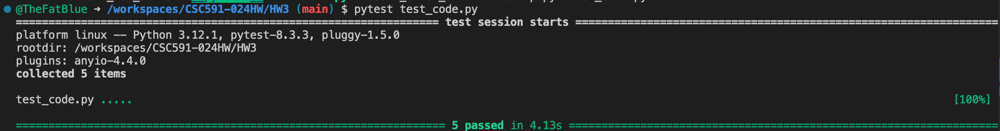

# JJR Hepo

## Overview
This project is a Python-based implementation to test a hypotheses in the context of low-dimensional and high-dimensional data. The experiments are designed to compare the performance of random guessing and active learning strategies in finding optimal solutions across various datasets.

### Hypotheses Tested
1. **JJR1**: Nothing works better than 50 random guessed for low dimensional problems (less than 6 x attributes).
2. **JJR2**: But such random guessing is rubbish for higher dimensional data.

The project runs experiments on datasets with varying dimensionality to validate these hypotheses.

## Project Structure

- `ezr.py`: Core functionality for handling data structure and active learning (credit to [timm/ezr](https://github.com/timm/ezr/tree/24Aug14)).
- `SnD.py`: Implements comparison between random sampling ("dumb") and active learning ("smart") strategies on different datasets.
- `test_code.py`: Unit tests to validate the correctness of the implemented methods.
- `Makefile`: Commands to automate experimental runs on different datasets based on their dimensionality.
- `rq.sh`: Script to aggregate and summarize experimental results.

## Installation
### Prerequisites
- Python 3.13
- No third-party libraries are required except for `pytest` (for testing).

### Setup
1. Install Python3.13. On Linux, doing so by running the command (credit to [Fundamentals](https://txt.github.io/se24fall/03code.html#try-it-for-yourself)):

    ```bash
    sudo apt update -y; sudo  apt upgrade -y; sudo apt install software-properties-common -y; sudo add-apt-repository ppa:deadsnakes/ppa -y ; sudo apt update -y ; sudo apt install python3.13 -y
    ```

2. Clone the repository and navigate to teh project directory.

    ```bash
    git clone https://github.com/DHP-NCSU/CSC591-024HW.git
    cd CSC591-024HW/HW3
    ```

3. Install `pytest` for testing:

   ```bash
   pip install pytest
   ```

4. Ensure that all the data files required for the experiments are placed in the `data` directory.

## Running the Experiments
### Command Line Execution
1. **Run Comparison (Single case)**:
   To run a comparative analysis between "dumb" and "smart" strategies on a given dataset:
   
   ```bash
   python3.13 SnD.py path/to/data.csv
   ```

2. **Makefile Commands (Multiple cases)**:
    - Generate script to run experiments on low- and high-dimensional data (This will take a while. Let's take a break =^_^=):
        ```bash
        make SnD_low_dim > SnD_low_dim.sh &
        make SnD_other_dim > SnD_other_dim.sh &
        ```
    - Run experiments on low-dimensional data, the outputs will be logged to separate files in the `tmp/SnD/low_dim` directory:
        ```bash
        bash SnD_low_dim.sh
        ```
    - Run experiments on high-dimensional data, the outputs will be logged to separate files in the `tmp/SnD/other_dim` directory (I do not recommend running this step along with the previous one, as both will submit a large number of jobs to the background simultaneously. You can track this progress by type `ps | grep python3.13` in the terminal):
        ```bash
        bash SnD_other_dim.sh
        ```

### Experimental Results Summary
After running the experiments, results are summarized using the `rq.sh` script. To view the results:
```bash
cd tmp/SnD/low_dim
bash ../../../rq.sh
```

This will generate tables with metrics such as:
- **RANKS**: Frequency of each strategy appearing in different ranks.
- **EVALS**: Evaluation budgets used for achieving those ranks.
- **DELTAS**: Percentage improvement over the baseline performance.

Similarly, you can summarize the results on high-dimensional data:
```bash
cd tmp/SnD/other_dim
bash ../../../rq.sh
```

## Running Tests
To verify the correctness of the code, run the tests using `pytest`:

```bash
pytest test_code.py
```

In this script, we verified the following points:

- Does `chebyshevs().rows[0]` return the top item in that sort?
- Are smart and dumb lists the right length (i.e. N)?
- Does you code really run some experimental treatment 20 times for statistical validity?
- Does `d.shuffle()` really jiggle the order of the data?

Here's the screenshot of the test result:



## Summary of Results
After completing the experiments, we use the `rq.sh` script to analyze and interpret the results. The output is showed below:

```bash
# Results on low-dimensional data
RANK         0           1            2           3           4
smart       87          13                                     
baseline                33           27           7          33
dumb        67          13           20                        
#
#EVALS
RANK               0           1            2           3           4
smart       28 (  4)    35 (  0)      0 (  0)     0 (  0)     0 (  0)
baseline     0 (  0)   4118 (  0)   668 (  0)   259 (  0)   643 (  0)
dumb        26 (  8)    25 (  0)     30 (  0)     0 (  0)     0 (  0)
#
#DELTAS
RANK               0           1            2           3           4
smart       76 ( 29)    36 (  0)      0 (  0)     0 (  0)     0 (  0)
baseline     0 (  0)     0 (  0)      0 (  0)     0 (  0)     0 (  0)
dumb        65 ( 29)    61 (  0)     71 (  0)     0 (  0)     0 (  0)

# Results on high-dimensional data
RANK         0            1            2            3            4            5
smart       88           12                                                    
baseline     3           24           21           24           15           15
dumb        50           32           15            3                          
#
#EVALS
RANK               0            1            2            3            4            5
smart       32 ( 12)     25 (  0)      0 (  0)      0 (  0)      0 (  0)      0 (  0)
baseline   3840 (  0)   2834 (  0)   9618 (  0)   3094 (  0)   3687 (  0)   34523 (  0)
dumb        26 (  0)     35 ( 12)     40 (  0)     30 (  0)      0 (  0)      0 (  0)
#
#DELTAS
RANK               0            1            2            3            4            5
smart       72 ( 23)     51 (  0)      0 (  0)      0 (  0)      0 (  0)      0 (  0)
baseline     0 (  0)      0 (  0)      0 (  0)      0 (  0)      0 (  0)      0 (  0)
dumb        65 ( 26)     62 ( 19)     60 (  0)     75 (  0)      0 (  0)      0 (  0)
```

## Conclusion
Based on the observed results from the experiments...