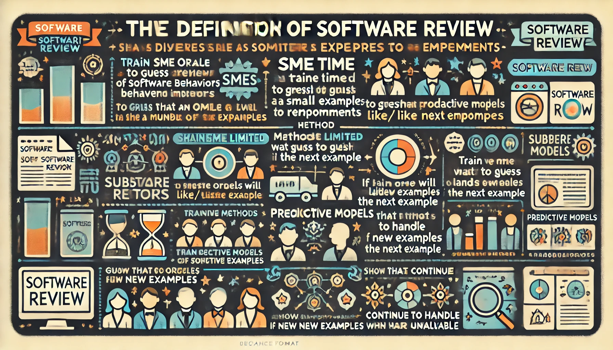

# Active Learning

- Assumes abundant access to examples, 
  - but very limited access to oracles that can label each example 
- A repeated result:
  - Learners learn better (using fewer labels)
  - if they can decode for them selves what examples to use.
- Goal:
  - build a competent model using as few labels as followed.

## Tricks: Often cheaper, faster, to find "X" than "Y"

- $Y=f(X)$
  - $X$,$Y$ are our independent and dependent variables.
  - $f$ is the thing we are trying to find
- e.g. Fishing: 
  - Glance up and down the river. 
  - That looks like a good spot. 
  - 3 hours later:  well, it was not
- e.g. Used car yard: 
   -  Glancing over 100 cars:  count the cars and their colors and number of wheels and size of car.
   -  But to find gas mileage-- got to take each out for a long drive.

## SE Examples where finding $X$ is  cheaper than $Y$

- $X$,$Y$ are our independent and dependent variables.
- Quick to mine $X$ GitHub to get code size, dependencies per function,  
  - Slow to get $Y$ (a) development time, (b) what people will pay for it
- Quick to count $X$ the number of classes in a system. 
  - Slow to get  $Y$ an organization to tell you human effort to build and maintain that code.
- Quick to enumerate $X$ many  design options (20 yes-no = $2^{20}$ options) 
  - Slow to check $Y$ those options with   the human stakeholders.
- Quick to list $X$ configuration parameters for  the  software. 
  - Slow to find $X$ runtime and energy requirements for all configurations.
- Quick to list $X$ data miner params (e.g. how many neighbors in knn?) 
  - Slow to find  $Y$ best setting for local data. 
- Quick to  make $X$ test case inputs using (e.g.) random input selection
  - Slow to run all tests and  get $Y$ humans to check each output 

## This is called "Active Learning"

- Learning works better if the learner can pick its training data[^brochu].
Given two models that predict for good $g$ or bad $b$:
- An active learning loop:

## An Active Learning Loop

- _Labelling_: given an example with $X$, but not $Y$, get the $Y$.
- Just for simplicity, assume we a model can inputs $X$ values to predict for good $g$ or bad $b$:

|n|Task | Notes|
|-:|-----|------|
|1|Sample a little  | Get a get a few $Y$ values (picked at random?) |
|2|Learn a little   | Build a tiny model from that sample|
|3| Reflect | Compute $b,r$|
|4| Acquire         | Label an example that (e.g.) maximizes $b/r$. Add it to the sample|
|5| Repeat          | Goto 2|

How to 
- Sample, once
  - Use reflection to find one unlabelled thingFind &$ the $X$ variables, 
  - guess what might be the next most informative example
  - get its $Y$ value, .

## Three kinds of active learning

## Methods

- Many and varied
- Here's my "SMO" (sequential model optimization):
 one candidate strategy (explored by co-PI Menzies~\cite{menzies2024streamlining}, amongst others) is:
\begin{enumerate}
    \item Label very few examples: e.g. just a handful examples of ``poisoned'' or not
    \item Model a little: using the labeled examples, build a classifier that can report
    the probabilities $y,n$ of an example being poisoned. 
    \item Acquire: Use the classifier to  sort     unlabeled example $i$  by an    acquisition  function $Q$ e.g.   $Q_i=y_i/n_i$. 
    \item Label the top-ranked example
    \item Goto step 2.   
\end{enumerate}
This loop is useful for reducing the cognitive load on humans, in two ways:
\begin{itemize}
    \item By reducing the total number of labels, humans are asked fewer questions;
    \item By reducing the total number of features shown to the user (in step \#3), we can also reduce the complexity of each question.
\end{itemize}
Aside: when showing code to a user, "reducing the number of features shown" means "controlling 
what information is highlighted" from the code snippet.  
Using code summarizing tools, we could infer examples (to be shown to the user) that are much
smaller than the actual snippets.   For example, using Markov
chain frequencies for the tokens in the code,  we could summarize by de-emphasize parts of the code
that have the same distributions in the poisoned/non-poisoned code samples.  

Note some implementation details:
\begin{itemize} 
\item 
A  common distinction in the active learning literature~\cite{Hospedales22} is between  pool-based active learning (where the supply of unlabeled examples is very large) and stream-based active learning (where the pool
divides into small buffers, and each learning session on has access to the next buffer).
\item Another distinction is for  {\em model query synthesis}, or MQS~\cite{BUDD2021102062}
where the example to be labeled is inferred using feature weightings taken from inside the classifier.   Active learners can use MQS to simplify what they show their oracles by focusing on just a few features (those with most weight). 
\item There is much research on appropriate acquisition functions (see ~\cite{Bilal20} for a succinct review
of that work). Some acquisition functions (such as UCB~\cite{brochu2010tutorial}) reflect not only on the prediction
for each unlabeled example, bur also the variance in that prediction. Other acquisition
functions are adaptive; i.e. as more labels are gathered they change from exploring regions of high variance to exploiting regions of high mean predicted value. 
\end{itemize}

- Do it simpler, faster. using fewer resources?
- Know how to combine things, such that you can more with less?
- Teach seemingly  complex things to newbies?

## Can we engineering an AI system? Simply? Quickly?

Here we explore dozens of SE problems [^data]
using explainable AI  for semi-supervised multi-objective optimization.

- Internally, this is coded via sequential model optimization and membership query synthesis.

Sounds complex, right? 

- But it ain’t. 
- In fact, as I hope to show,  all the above is just a hundred lines of code (caveat: if  you are using the right underlying object model).

[^data]: [github.com/timm/ezr/tree/main/data](https://github.com/timm/ezr/tree/main/data)

## Which raises the question.... 

What else is similarly simple? 

- How many of our complex problems ... aren’t? 

My challenge to you is this: 

- Please go and find out. 
- Take a working system, see what you can throw away (while the remaining system is still useful and fast). 
- Let me know happens so I can add your fantastic new, and simple, idea to this code 

## Why study simplicity?

- Cause we are getting really really good at reasoning with very little data
- Cause its good science
  - If you really understand "it", can you do "it" again, very very simply
- Cause the world is changing
  - Next generation of satellite internet providers
  - Connecting millions of new programmers willing to work for $\frac{1}{20}$th of the salary you want
  - In that world, you do not want to be the programmer
  - You want to be the optimizer who controls and improves the work of others.
- Cause almost no one else is studying reasoning with very little data

## Why study simplicity? (2)

- Cause everyone has gone mad on complexity.
  - A small number of very large companies  have built empires based on "big data"
  - Five years ago, no on one wanted to head about simplicity
  - But after three years of constant tech lay offs, and increasing challenges for getting jobs at these large
organizations ...
  - ... my students now know they need to graduate with knowledge about "big data" AND alternate approaches.
- Cause big data is  running out of data (see next slide).

## Surfing the long tail

- LLMs? For everything?
  - LLMs  know a lot, about things we do a lot (e.g.  "if" statements in code)
  - And they know _less_ about things we do _less_ often
- Model collapse: 
  - We are about to run out of training data [^less24] for LLMs.
  - Can't reply of synthetic data generation (no new information from data already seen)
- So,  we make do with _less_ data?
  - Are their domain,  were models need less, not more, data?

[^less24]:  Udandarao, V., Prabhu, A., Ghosh, A., Sharma, Y., Torr, P.H., Bibi, A., Albanie, S. and Bethge, M., 2024.  No" zero-shot" without exponential data: Pretraining concept frequency determines multimodal model performance. arXiv preprint arXiv:2404.04125.

## Aside: Q: What is Software Engineering?

- A: The delivery and maintainable of software products to an acceptable standard, built using
    current constraints.
- LLMs build  "quality" solutions?   That respect "current constraints"?
- Do LLMs work for all tasks?  
  - Not really[^hype].  They often produce useful suggestions.  But mixed in with the good is also the bad, the terrible, the misleading and the dangerous[^hype].
- Are LLMs bad science? 
  - Harder for  research  LLM papers  to, say, run 20 times and report the variability in the results
  - Harder for other researchers to check results from other people.
  - AI needs 1% of world's power, creating 4% of our carbon emissions[^durmus]
- Do they need too much data ? (above)
- Are there other options? That use less data? That can be tested?

[^durmus]: [www.linkedin.com/pulse/data-centers-its-environmental-impacts-i%C5%9F%C4%B1l-durmu%C5%9F-q5xvf/](https://www.linkedin.com/pulse/data-centers-its-environmental-impacts-i%C5%9F%C4%B1l-durmu%C5%9F-q5xvf/)
[^hype]: [docs.google.com/document/d/1dF4GePCf04IW5uZnRSGQXRlzo5VyD5u0PQ3hfy-Zd6Q/edit](https://docs.google.com/document/d/1dF4GePCf04IW5uZnRSGQXRlzo5VyD5u0PQ3hfy-Zd6Q/edit).

##  Application of Little Data in SE: Software Review 

{ width=300px }  

- The more we use AI in SE, the more code will be auto-generated. 
- The more we auto-generate code
  - the less time software engineers spend writing and reviewing new code, written by someone
    or something else (which internally, are a mystery)
- The less we understand code, 
  - the more we will use black-boxes components, where, once a system is assembled, its control settings are tuned. 

In this scenario: we must reduce the effort (human and CPU) for that tuning.

## More on Software Review

- We define “software review” as a panel of SMEs (subject matter experts),
  looking at examples of behavior to recommend how to improve software.
- SME time is usually very limited so, such reviews must complete after 
  looking at just a small number of very informative examples. 
- To support the software review process, we explore methods that train 
  a predictive model to guess if some oracle will like/dislike the next example. 
- These predictive models work with SMEs to guide them as they explore the examples. Afterwards, the models
  can handle new examples, while the panelists are busy, elsewhere

## Q: How few questions can humans answer?

A: Not so many

What | N
:----|:-------
Standard theory |  more is always better
Cognitive Science | 7 plus or minus 2
From human studies (cost estimation, rep grids)[^smith80]  |  10 to 20 examples per 1-4 hours
Regression [^quora] | 10-20 examples per attribute
Semi-supervised learning | $\sqrt{N}$
Zhu et al.[^zhu16] | 100 images
Menzies et al. 2008[^Me08] | 50 examples
Chessboard model[^me05]   | 200 examples
Probable Correctness theory[^ham89] | simpler cases: 50 to 6 (if binary chop) 
|                             | safety-critical cases: 272 to 8 (if binary chop)
 
[^quora]: www.quora.com/How-many-data-points-are-enough-for-linear-regression

[^me05]: J. Nam, W. Fu, S. Kim, T. Menzies and L. Tan, "Heterogeneous Defect Prediction," in IEEE Transactions on Software Engineering, vol. 44, no. 9, pp. 874-896, 1 Sept. 2018, doi:

[^ham89]: My personnel reading of Richard G. Hamlet. 1987. Probable correctness theory. Inf. Process. Lett. 25, 1 (20 April 1987), 17–25. https://doi.org/10.1016/0020-0190(87)90088-3

[^smith80]: M. Easterby-Smith, Design, analysis and interpretation of repertory grids, International Journal of Man-Machine Studies, 13(1), 1980, 3-24,

## Tricks: Often cheaper, faster, to find "X" than "Y"

- $Y=f(X)$
  - $X$,$Y$ are our independent and dependent variables.
  - $f$ is the thing we are trying to find
- e.g. Fishing: 
  - Glance up and down the river. 
  - That looks like a good spot. 
  - 3 hours later:  well, it was not
- e.g. Used car yard: 
   -  Glancing over 100 cars:  count the cars and their colors and number of wheels and size of car.
   -  But to find gas mileage-- got to take each out for a long drive.

## SE Examples where finding $X$ is  cheaper than $Y$

- $X$,$Y$ are our independent and dependent variables.
- Quick to mine $X$ GitHub to get code size, dependencies per function,  
  - Slow to get $Y$ (a) development time, (b) what people will pay for it
- Quick to count $X$ the number of classes in a system. 
  - Slow to get  $Y$ an organization to tell you human effort to build and maintain that code.
- Quick to enumerate $X$ many  design options (20 yes-no = $2^{20}$ options) 
  - Slow to check $Y$ those options with   the human stakeholders.
- Quick to list $X$ configuration parameters for  the  software. 
  - Slow to find $X$ runtime and energy requirements for all configurations.
- Quick to list $X$ data miner params (e.g. how many neighbors in knn?) 
  - Slow to find  $Y$ best setting for local data. 
- Quick to  make $X$ test case inputs using (e.g.) random input selection
  - Slow to run all tests and  get $Y$ humans to check each output 

## This is called "Active Learning"

- Learning works better if the learner can pick its training data[^brochu].
Given two models that predict for good $g$ or bad $b$:
- An active learning loop:

## An Active Learning Loop

- _Labelling_: given an example with $X$, but not $Y$, get the $Y$.
- Just for simplicity, assume we a model can inputs $X$ values to predict for good $g$ or bad $b$:

|n|Task | Notes|
|-:|-----|------|
|1|Sample a little  | Get a get a few $Y$ values (picked at random?) |
|2|Learn a little   | Build a tiny model from that sample|
|3| Reflect | Compute $b,r$|
|4| Acquire         | Label an example that (e.g.) maximizes $b/r$. Add it to the sample|
|5| Repeat          | Goto 2|

How to 
- Sample, once
  - Use reflection to find one unlabelled thingFind &$ the $X$ variables, 
  - guess what might be the next most informative example
  - get its $Y$ value, .

## Three kinds of active learning

