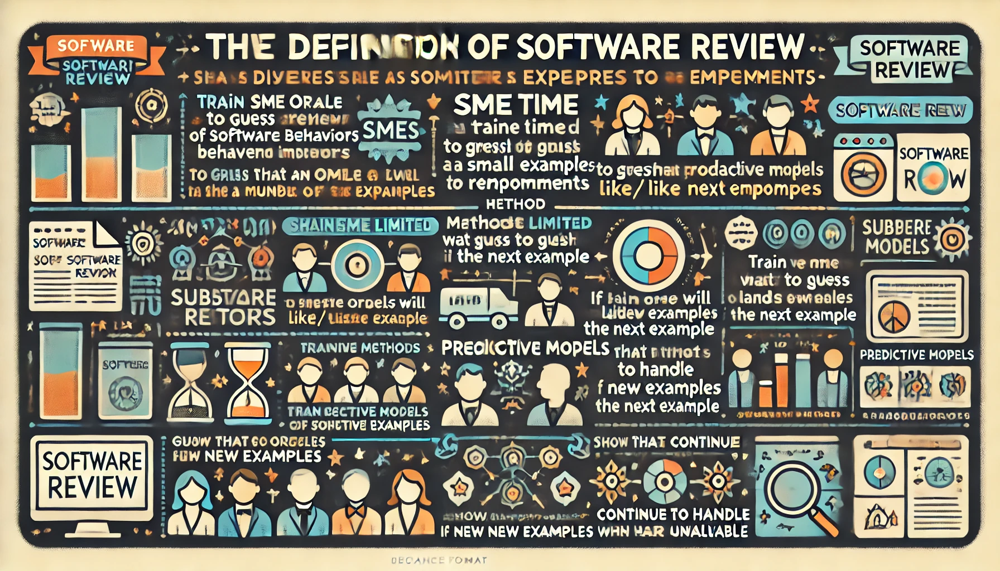

% Intro SE 4 AI
% Tim Menzies
% March 22, 2024

## I want you... to be an (AI) brain surgeon

- I want to make you the AI software engineers:
  - that know how to  reach inside smart algorithms and make changes
- Surely, by now, we can do that:
  - If you have been doing something for a while then can you or I:
    - Do it simpler, faster. using fewer resources?
    - Know how to combine things, such that you can more with less?
    - Teach seemingly  complex things to newbies?

## Can we engineering an AI system? Simply? Quickly?

Here we explore dozens of SE problems [^data]
using explainable AI  for semi-supervised multi-objective optimization.

- Internally, this is coded via sequential model optimization and membership query synthesis.

Sounds complex, right? 

- But it ain’t. 
- In fact, as I hope to show,  all the above is just a hundred lines of code (caveat: if  you are using the right underlying object model).

[^data]: [github.com/timm/ezr/tree/main/data](https://github.com/timm/ezr/tree/main/data)

## Which raises the question.... 

What else is similarly simple? 

- How many of our complex problems ... aren’t? 

My challenge to you is this: 

- Please go and find out. 
- Take a working system, see what you can throw away (while the remaining system is still useful and fast). 
- Let me know happens so I can add your fantastic new, and simple, idea to this code 

## Why study simplicity?

- Cause we are getting really really good at reasoning with very little data
- Cause its good science
  - If you really understand "it", can you do "it" again, very very simply
- Cause the world is changing
  - Next generation of satellite internet providers
  - Connecting millions of new programmers willing to work for $\frac{1}{20}$th of the salary you want
  - In that world, you do not want to be the programmer
  - You want to be the optimizer who controls and improves the work of others.
- Cause almost no one else is studying reasoning with very little data

## Why study simplicity? (2)

- Cause everyone has gone mad on complexity.
  - A small number of very large companies  have built empires based on "big data"
  - Five years ago, no on one wanted to head about simplicity
  - But after three years of constant tech lay offs, and increasing challenges for getting jobs at these large
organizations ...
  - ... my students now know they need to graduate with knowledge about "big data" AND alternate approaches.
- Cause big data is  running out of data (see next slide).

## Surfing the long tail

- LLMs? For everything?
  - LLMs  know a lot, about things we do a lot (e.g.  "if" statements in code)
  - And they know _less_ about things we do _less_ often
- Model collapse: 
  - We are about to run out of training data [^less24] for LLMs.
  - Can't reply of synthetic data generation (no new information from data already seen)
- So,  we make do with _less_ data?
  - Are their domain,  were models need less, not more, data?

[^less24]:  Udandarao, V., Prabhu, A., Ghosh, A., Sharma, Y., Torr, P.H., Bibi, A., Albanie, S. and Bethge, M., 2024.  No" zero-shot" without exponential data: Pretraining concept frequency determines multimodal model performance. arXiv preprint arXiv:2404.04125.

## Aside: Q: What is Software Engineering?

- A: The delivery and maintainable of software products to an acceptable standard, built using
    current constraints.
- LLMs build  "quality" solutions?   That respect "current constraints"?
- Do LLMs work for all tasks?  
  - Not really[^hype].  They often produce useful suggestions.  But mixed in with the good is also the bad, the terrible, the misleading and the dangerous[^hype].
- Are LLMs bad science? 
  - Harder for  research  LLM papers  to, say, run 20 times and report the variability in the results
  - Harder for other researchers to check results from other people.
  - AI needs 1% of world's power, creating 4% of our carbon emissions[^durmus]
- Do they need too much data ? (above)
- Are there other options? That use less data? That can be tested?

[^durmus]: [www.linkedin.com/pulse/data-centers-its-environmental-impacts-i%C5%9F%C4%B1l-durmu%C5%9F-q5xvf/](https://www.linkedin.com/pulse/data-centers-its-environmental-impacts-i%C5%9F%C4%B1l-durmu%C5%9F-q5xvf/)
[^hype]: [docs.google.com/document/d/1dF4GePCf04IW5uZnRSGQXRlzo5VyD5u0PQ3hfy-Zd6Q/edit](https://docs.google.com/document/d/1dF4GePCf04IW5uZnRSGQXRlzo5VyD5u0PQ3hfy-Zd6Q/edit).

##  Application of Little Data in SE: Software Review 

{ width=300px }  

- The more we use AI in SE, the more code will be auto-generated. 
- The more we auto-generate code
  - the less time software engineers spend writing and reviewing new code, written by someone
    or something else (which internally, are a mystery)
- The less we understand code, 
  - the more we will use black-boxes components, where, once a system is assembled, its control settings are tuned. 

In this scenario: we must reduce the effort (human and CPU) for that tuning.

## More on Software Review

- We define “software review” as a panel of SMEs (subject matter experts),
  looking at examples of behavior to recommend how to improve software.
- SME time is usually very limited so, such reviews must complete after 
  looking at just a small number of very informative examples. 
- To support the software review process, we explore methods that train 
  a predictive model to guess if some oracle will like/dislike the next example. 
- These predictive models work with SMEs to guide them as they explore the examples. Afterwards, the models
  can handle new examples, while the panelists are busy, elsewhere

