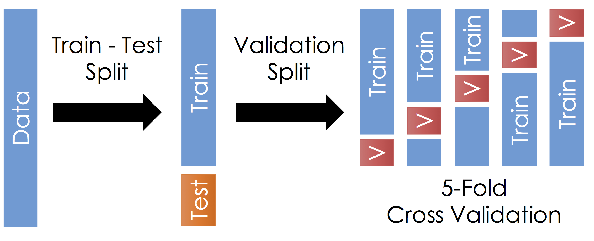
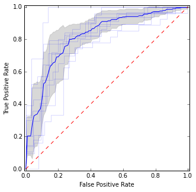

# The Big Picture (contaoms many small pictures)

Much current work focuses on on the use of large general models.  That
works fine, unless you are dealing with some specific
program that is they not
covered by the general models.
So 
when generality fails, you need to build local models.

Another reason to build a local model is that, when using a global model,
you need to be able to test its effectiveness. Local modeling is how
we build the oracle that 
can judge model output. 

Local data
can be hard to find and building local models can be a tedious process.
So we need shortcuts that lets us build model with minimal data/effort.
Decades of work with AI analytics  had found many such short cuts.

## Near enoguh (is good enough)

Many models learned by AI exhibit
  an inherent variability  when (say)  built $N$ times, each time using 90% of 
  the available data. 

 

This means that any promise that a model achieves
  some level of performance has be statistical in nature. Modeling
  can stop early when once we find methods that
  are statistically indistinguishable    from the top score.

This can have a profound impact on the modeling process. Cohen tells us that
two values are statistically indistinguishable if they differ by less than 0.35 of the standard deviation

(To be premcise, Cohen's thresholds are 0.2 and 0.5 for small and medium. O.35 is hence the boundary between medium and small.)
 

[^cohen1:] Actually, cohen

Hence, local learning first focuses  on
easily accessible features (independent variables) in order to
quickly identify and select the most informative samples for labeling.
This reduces the overall cost and time required to train the model
effectively (as we only spend resources on obtaining labels for the
most valuable data points).

This trick works since a lot of data contains spurious information.
Much resaerch shows that a small number of rows can server as
exemplrs for the rest, Also, for any task, only a few attributes
are relevant. For example, if we look at 10% of the attributes
and the square root of the number of rows then a table of data with
100 attributes and 10,000 rows only has  1% of most information
cells (10 attriutes and 100 rows).

So local learning can be really fast since it only needs
to explore (say) the square root
of the number of rows and only a handful of attributes. For example,

<table>
<tr><td> n <td> name <td> what <td> notes </tr>
<tr><td> 1
<td> faraway
<td> find 2 points, faraway from each other 
<td> To find quickly find 2 distant points, pick anything at random, 
     find something else furthese from that,
     find something furhest from that second point.
     To avoid strange outliers, only go (say) 90% to the furthese point. </tr>
<tr><td> 2
<td> rank
<td> Given two faraway points, sort them by their y-values.
<td> Y-values can be sorted via 
     (a) binary domination 
         (the best is worse on none, better or at lease one);
     (b) Ziztler's predicate (the best loses less when you move 
         from other to best rather than best to other);
     (c) distance fo heaven- the (Euclidean distance of y-values to
         best possible;
     (d) Chebyshev distance- the max of the difference between y-values on any axis.</tr>
<tr><td> 3
<td> half
<td> 
</table>

Algo2: half = divide data according to its distance to 2 faraway points.

# Todo

- shufflethe rows
- sort examples by cheb
