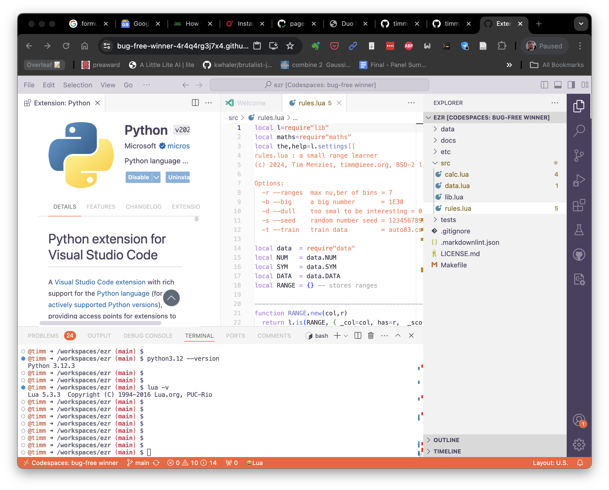

# Editing and Debugging

(There notes are for any apprentice programmers reading this material.)

## Editing

Ideally,
we'd like to support everyone using whatever tools they like.

Pragmatically, when teaching dozens to 100s of students, that is not possible. So please, humor us, at least once
set yourself up with the latest version of Python running on Github
codespaces.

**SUBMIT** the following screen snap from your own browser.

Note you are running an on-line version
of VScode, you have split the screen in half, you can edit a source code file,
you can see the file tree, you have enabled the Python extension and, in the terminal, you have install 
a recent version of Python (3.12) and Lua (5.3). 

You may need to run the following commands to get python3.12 to work:

    sudo add-apt-repository ppa:deadsnakes/ppa
    sudo apt update -y
    sudo apt install python3.12 
    sudo apt install lua5.3
    python3.12

## Debugging

Watch a video on how to use the 
[debugger in VScode](https://www.youtube.com/watch?v=XmpIBsnc3xU).

**SUBMIT** a screen shot of you entering in a conditional break point 
(using the methods described in that video).
